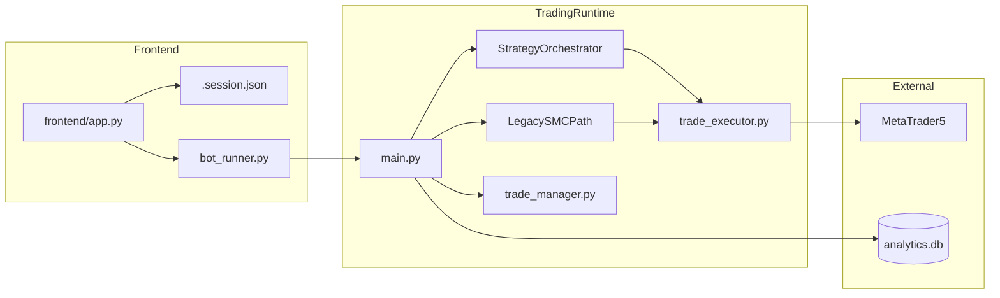

# Forex Signal Bot — Architecture Summary

> High-level map for new contributors. Read this first, then explore the folders listed below.

## What this project is

A **MetaTrader 5 (MT5) automated trading system** for forex/crypto symbols (e.g. `XAUUSDm`, `BTCUSDm`), built around **Smart Money Concepts (SMC)**:

- Multi-timeframe bias and structure
- Liquidity sweeps, displacement, order blocks / breakers
- Confluence scoring and risk gates before execution
- Live trade management (partial TP, trailing, kill-switch, profit lock)
- Streamlit dashboard for monitoring and control
- SQLite analytics and trade journaling

---

## Repository layout (top level)

| Path | Role |
|------|------|
| `main.py` | **Main runtime loop** — connects MT5, evaluates symbols, executes trades, monitors open positions |
| `trade_executor.py` | Sends orders to MT5, persists `open_trades.json`, trade open logging |
| `trade_manager.py` | Profit-lock / tiered exit management on open positions |
| `trend_filter.py` | Legacy trend helper (optional / older path) |
| `bot/` | Modular engine: orchestrator, analysis, execution, data, utils |
| `strategies/smc_engine/` | SMC strategy logic (structure, liquidity, displacement, OB, entry) |
| `config/symbol_profiles/` | Per-symbol tuning (timeframes, risk, engine thresholds) |
| `utils/` | Shared helpers: MT5 fetch, logging, risk, notifications, analytics DB, journal |
| `frontend/` | Streamlit UI (dashboard, strategy view, analytics, AI, settings) |
| `backtests/` | Shadow/backtest scripts and result folders |
| `data/` | Runtime data (e.g. `analytics.db`) |
| `logs/` | Trade logs, loop snapshots, orchestrator errors |
| `secrets/` | Firebase / credentials (not committed) |
| `mobile_app/` | Mobile-related assets (if used) |
| `.env` | MT5 credentials, Telegram, FCM, etc. |
| `requirements.txt` | Python dependencies |

### `bot/` package

| Path | Role |
|------|------|
| `bot/state/orchestrator.py` | Gate-based strategy orchestrator (`StrategyOrchestrator`) |
| `bot/analysis/bias_engine.py` | Multi-timeframe HTF bias (W1, D1, H4, H1, M15) |
| `bot/analysis/liquidity_map.py` | PDH/PDL, Asian range, equal highs/lows pools |
| `bot/analysis/dxy_filter.py` | DXY correlation filter (XAU) |
| `bot/analysis/fvg_engine.py` | Fair value gap detection |
| `bot/execution/risk_engine.py` | Position sizing, RR validation, daily drawdown |
| `bot/execution/confluence_scorer.py` | Setup scoring (threshold to trade) |
| `bot/execution/news_filter.py` | News blackout windows |
| `bot/data/market_data.py` | Normalized MT5 OHLCV fetch + batch |
| `bot/utils/session_clock.py` | Session / killzone context |

### `strategies/smc_engine/` package

| File | Role |
|------|------|
| `strategy_state.py` | Per-symbol persistent state machine |
| `market_structure.py` | Structure, BOS, CHoCH, confidence |
| `liquidity_engine.py` | Liquidity sweep detection |
| `displacement_engine.py` | Impulse / displacement + FVG |
| `ob_breaker_engine.py` | Order block / breaker zones |
| `entry_model.py` | Entry type and timing (market / limit) |

### `frontend/` package

| Path | Role |
|------|------|
| `frontend/app.py` | Streamlit entry, navigation, theme |
| `frontend/ui_pages/login_page.py` | MT5 session login |
| `frontend/ui_pages/dashboard_page.py` | Equity, P/L, process status |
| `frontend/ui_pages/strategy_page.py` | Last loop, bias, trade/skip reasons |
| `frontend/ui_pages/analytics_page.py` | Performance and no-trade breakdown |
| `frontend/ui_pages/ai_page.py` | AI commentary (Ollama / Groq) |
| `frontend/ui_pages/settings_page.py` | Risk settings, start/stop bot |
| `frontend/utils/bot_runner.py` | Spawns/kills `main.py` subprocess |
| `frontend/utils/bot_control.py` | UI control state file (pause/stop) |
| `frontend/utils/session_manager.py` | User settings persistence |
| `frontend/utils/mt5_connector.py` | MT5 connection for dashboard |

---

## Runtime flow

1. **Streamlit UI** reads/writes `frontend/utils/.session.json` (capital, daily target, BTC toggle).
2. **Settings → Start Bot** launches `main.py` via `frontend/utils/bot_runner.py` (PID tracked in `.bot_process.json`).
3. **`main.py`** connects to MT5, runs the evaluation loop, places orders, and records telemetry.

---

## Main loop behavior (`main.py`)

Each outer cycle (~60 seconds, `LOOP_DELAY`):

1. **Refresh runtime settings** from `frontend/utils/.session.json` (no restart required).
2. **Show profit summary** and **monitor open trades** (`monitor_trades`) — partial TP, kill-switch, HTF trail.
3. **Evaluate each enabled symbol** (`evaluate_symbol`) — open new trades if gates pass.
4. **Inner sub-loop** (~22.5s): call `trade_manager.manage_open_trades` every 1.5s × 15 for profit-lock exits.

Default symbols: `XAUUSDm`, `BTCUSDm`. BTC can be disabled at runtime via session `btc_enabled`.

---

## Trading engines (two modes)

Controlled by environment variable `BOT_ACTIVE_ENGINE` (default: orchestrator).

| Mode | When | Entry path |
|------|------|------------|
| **Orchestrator (live)** | `BOT_ACTIVE_ENGINE` is not `legacy`, `old`, or `classic` | `StrategyOrchestrator` → gates → `execute_orchestrator_live()` |
| **Legacy SMC** | `BOT_ACTIVE_ENGINE=legacy` (or `old` / `classic`) | Inline pipeline inside `evaluate_symbol()` |

**Shadow mode:** `run_shadow_orchestrator()` runs the orchestrator in parallel for logging only — it does not place or block live trades.

---

## Orchestrator pipeline

**Class:** `bot/state/orchestrator.py` → `StrategyOrchestrator.evaluate_symbol()`

**Returns:** `OrchestratorResult` with `action`, `reason`, `state_name`, and rich `context` for logs/UI.

| Step | Gate | Module |
|------|------|--------|
| 1 | Session / killzone | `bot/utils/session_clock.py` |
| 2 | News blackout | `bot/execution/news_filter.py` |
| 3 | Daily drawdown limit | `bot/execution/risk_engine.py` |
| 4 | Max concurrent trades | `RiskEngine.can_open_more_trades()` |
| 5 | HTF bias | `bot/analysis/bias_engine.py` |
| 6 | DXY correlation (XAU) | `bot/analysis/dxy_filter.py` |
| 7 | Liquidity map + sweep | `bot/analysis/liquidity_map.py`, `strategies/smc_engine/liquidity_engine.py` |
| 8 | Displacement + FVG | `displacement_engine.py`, `bot/analysis/fvg_engine.py` |
| 9 | OB / breaker | `ob_breaker_engine.py` |
| 10 | Internal M15 structure | `market_structure.py` |
| 11 | Confluence score | `bot/execution/confluence_scorer.py` |
| 12–13 | Entry + RR / sizing (live) | `entry_model.py`, then `execute_orchestrator_live()` in `main.py` |

**Per-symbol state:** `strategies/smc_engine/strategy_state.py` (`StrategyState`) — structure, liquidity, displacement, setup candidate, expiry (120 min default).

**Key actions:** `candidate_ready`, `wait`, `skip`, `pause`, `halt`, `error`.

---

## Execution and risk

| Component | File | Responsibility |
|-----------|------|----------------|
| Order placement | `trade_executor.py` | `execute_trade()` — market orders, SL/TP, alerts, journal |
| Risk engine | `bot/execution/risk_engine.py` | Lot from balance + stop distance; min RR (default 3.0); daily DD cap (default 3%) |
| Legacy risk | `utils/risk.py` | Older lot calculation (legacy path) |
| Open trade registry | `open_trades.json` | JSON mirror of bot-tracked tickets |
| Profit lock | `trade_manager.py` | Tiered lock → auto-close on retrace |
| Position monitoring | `main.py` → `monitor_trades()` | Partial close at 1R, BE+, structure kill-switch, HTF trail |

**Symbol profiles:** `config/symbol_profiles/` (e.g. `xauusdm.py`, `btcusdm.py`) loaded via `utils/symbol_profiles.py` and applied in `apply_symbol_profile()` in `main.py`.

**Live orchestrator execution guard:** If fill RR is below minimum or SL/TP are invalid vs entry, the bot closes the position immediately after open.

---

## Data and observability

| Source | Module | Notes |
|--------|--------|-------|
| MT5 OHLCV | `bot/data/market_data.py`, `utils/fetch.py` | Normalized DataFrames; batch fetch for bias/liquidity |
| Analytics DB | `utils/analytics_db.py` | SQLite at `data/analytics.db` |
| Trade journal | `utils/trade_journal.py` | JSONL at `logs/trade_journal.jsonl` + backfill into analytics |
| Loop snapshots | `record_loop_snapshot()` | Why each symbol traded or skipped (Strategy/Analytics UI) |
| AI reviews | `utils/loop_ai.py` | Optional post-loop commentary stored in analytics DB |

**Tables (analytics.db):** `trade_events`, `loop_snapshots`, `ai_reviews`.

**Older DB files:** `history.db`, `bot.sqlite` at project root (legacy/local artifacts).

---

## Frontend (Streamlit)

**Entry:** `streamlit run frontend/app.py`

| Page | File | Purpose |
|------|------|---------|
| Login | `ui_pages/login_page.py` | MT5 credentials → session |
| Dashboard | `ui_pages/dashboard_page.py` | Equity, daily target, bot/UI process status |
| Strategy | `ui_pages/strategy_page.py` | Last loop, structure, entry decisions |
| Analytics | `ui_pages/analytics_page.py` | Win rate, no-trade reasons, setup stats |
| AI Copilot | `ui_pages/ai_page.py` | Ollama/Groq loop and trade commentary |
| Settings | `ui_pages/settings_page.py` | Capital, targets, start/stop bot, integrations |

**Process control:**

- `frontend/utils/bot_runner.py` — spawns/kills `main.py`, logs to `logs/ui_bot.log`
- `frontend/utils/bot_control.py` — writes `.bot_state.json` (`running` / `paused` / `stopped`)

**Important:** `bot_control` pause/stop state is displayed in the UI but **`main.py` does not read `.bot_state.json` today**. Stopping the bot requires **Stop Bot** (kills the process) or killing `main.py` manually.

---

## Configuration and environment

| Item | Location / name |
|------|-----------------|
| MT5 login | `.env` → `MT5_LOGIN`, `MT5_PASSWORD`, `MT5_SERVER` |
| Bot capital override | `BOT_CAPITAL` env or session `capital` in `.session.json` |
| Active engine | `BOT_ACTIVE_ENGINE` (`orchestrator` default; `legacy` for old path) |
| News events feed | `NEWS_EVENTS_PATH` (optional JSON file) |
| Telegram alerts | `TELEGRAM_BOT_TOKEN`, `TELEGRAM_CHAT_ID` |
| Push (FCM) | `secrets/firebase-service-account.json`, `FCM_DEVICE_TOKEN` / `FCM_DEVICE_TOKENS` |

**Session file:** `frontend/utils/.session.json` — capital, `daily_target_pct`, lock profit, refresh interval, `btc_enabled`.

---

## How to run

1. Install dependencies: `pip install -r requirements.txt`
2. Configure `.env` and ensure MT5 terminal is running
3. **Trading bot:** `python main.py` (or **Start Bot** from Settings in the UI)
4. **Dashboard:** `streamlit run frontend/app.py`

Optional: `start_mobile_access.bat` for mobile access setup.

---

## Suggested reading order for new developers

1. This file (`ARCHITECTURE.md`)
2. `main.py` — `if __name__ == "__main__"` loop, `evaluate_symbol`, `execute_orchestrator_live`
3. `bot/state/orchestrator.py` — full gate pipeline
4. `strategies/smc_engine/` — SMC building blocks (start with `strategy_state.py`, then `market_structure.py`)
5. `trade_executor.py` + `bot/execution/risk_engine.py`
6. `frontend/app.py` + `frontend/ui_pages/settings_page.py`
7. `utils/analytics_db.py` — how telemetry is stored and queried

---

## Glossary

| Term | Meaning |
|------|---------|
| SMC | Smart Money Concepts — structure, liquidity, order blocks, fair value gaps |
| HTF / LTF | Higher / lower timeframe (e.g. H1 vs M15) |
| BOS | Break of structure |
| CHoCH | Change of character |
| OB | Order block |
| FVG | Fair value gap |
| RR | Risk-reward ratio |
| PDH / PDL | Previous day high / low |
| Shadow mode | Orchestrator evaluates and logs without placing live orders |
| Gate | A check that must pass before the orchestrator advances toward a trade |

---

## Maintainer notes

**Strengths**

- Clear SMC domain split under `strategies/smc_engine/` and `bot/analysis/`
- Gate-based orchestrator with rich `context` for debugging and the UI
- Multiple safety layers: news blackout, drawdown halt, RR validation, post-fill execution guard
- Solid observability: loop snapshots, trade events, optional AI reviews

**Known architectural tensions**

- `main.py` is large (~2000 lines) — orchestration, legacy engine, monitoring, and live execution coexist
- Legacy vs orchestrator paths use **different risk/RR defaults** (e.g. orchestrator `min_rr=3.0` vs legacy `min_execution_rr=1.2` in profiles)
- UI pause state (`.bot_state.json`) is **not consumed** by the trading loop
- Duplicate utilities: `utils/log.py` vs `utils/logger.py`; `utils/fetch.py` vs `bot/data/market_data.py`
- `open_trades.json` is file-based state — not transactional under crash or concurrent writers

---

*Last updated: 2026-05-27*
